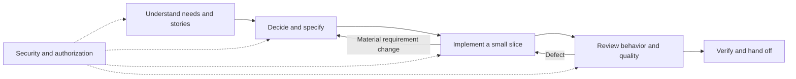

# A small development workflow built from skills

Status: research-backed proposal, 2026-09-05. The proposed skills below are not implemented or installed. This document is a workflow design; it does not certify any existing skill or application.

**One entry point, five working skills, and one change record.** Cover the full lifecycle without making every phase a separate tool, agent or document. Existing upstream skills provide techniques; the owned framework provides consistent handoffs, scope and evidence.

The [research](research/development-workflow.md) compares the sources and alternatives. The [worked example](examples/development-workflow.md) shows requirements, stories, an ADR, authorization rules and verification links together.

## The workflow



Security starts in the requirements and design, then receives an implementation review. A role name alone does not define which records or fields a user may access. [OWASP Authorization guidance](https://cheatsheetseries.owasp.org/cheatsheets/Authorization_Cheat_Sheet.html)

### Proposed skill boundaries

Names are candidates for future packages, not commands available today.

| Skill | Responsibility | Handoff and completion condition |
| --- | --- | --- |
| `delivery-workflow` | Locate the change, determine the next unmet gate, route work and retain state | Explains current status, evidence and outstanding scope; never equates verified, merged and released |
| `delivery-requirements` | Gather the problem, actors, evidence, constraints, non-goals and valuable user stories | Stories have observable acceptance criteria; assumptions and policy questions are visible |
| `delivery-specification` | Resolve design choices, write significant ADRs, specify behavior, contracts and relevant quality constraints | Each criterion has a verification method; affected authorization and migration rules are explicit |
| `delivery-implementation` | Turn the bounded specification into tasks and tested vertical slices | Code and tests trace to criteria; implementation discoveries update the specification openly |
| `delivery-review` | Independently compare the actual changes with the specification, then review code quality and relevant non-security risks | Each criterion and changed surface has evidence, a finding, or an explicit outstanding check |
| `delivery-security` | Identify threats during design and review security/authorization enforcement after implementation | Applicable permission rules and negative cases have separate evidence; unresolved findings retain owners and scope |

ADRs belong to specification, rather than requiring a seventh skill. Planning belongs to implementation, rather than requiring another document generator. Use an independent reviewer for consequential changes, but do not force six concurrent agents for a small fix.

## Small artifact contract

Start with a single `docs/changes/<change-id>.md` or the repository's existing issue/specification record. It contains the problem and source, stories, acceptance criteria, decisions, relevant interfaces/policies, tasks and verification. Grow separate files only when they improve readability or independent work:

```text
docs/changes/<change-id>.md       default change record
docs/adr/<id>-<decision>.md       only significant durable decisions
docs/changes/<change-id>/        optional larger-change split
  spec.md
  tasks.md
  verification.md
```

Use the single record or the split layout, not two competing specifications. Link shared domain definitions and authorization policy from their canonical locations. Preserve significant ADRs as superseded history when decisions change. This borrows ADR practice without requiring a decision record for routine edits. [Nygard's original ADR guidance](https://cognitect.com/blog/2011/11/15/documenting-architecture-decisions)

Keep stable criterion IDs. A compact relationship such as `need → story → criterion → task/test → result`, with an optional ADR link, makes omissions visible. Multiple tests can verify one criterion; a test may cover several criteria. Test syntax is optional: discover rules and examples first, then use Gherkin when it helps stakeholders and the test suite. [Example Mapping](https://cucumber.io/blog/bdd/example-mapping-introduction/)

## Gates that mean something

| Gate | Required evidence |
| --- | --- |
| Ready to specify | Bounded problem, affected actors, existing behavior and intended outcome |
| Ready to implement | Observable criteria, settled business-critical policy, applicable contracts and planned checks; significant decisions recorded |
| Ready to review | Scoped implementation, meaningful tests, actual changed-file inventory including applicable staged, unstaged and untracked work |
| Verified | Criteria reconciled with observed results, required local checks passed, applicable runtime/visual checks completed, findings dispositioned |
| Merged / released | Each actual operation separately authorized and verified; release adds its rollout/recovery and post-release checks |

“Verified” means the agreed scope passed its required checks, not that every possible defect is absent. Record the tested code revision and relevant working-tree state, command, environment, outcome, skips and artifact pointer. Changed relevant code invalidates its evidence; unchanged validated work does not need ceremonial repetition.

A materially unresolved business rule blocks its dependent work. Record the decision owner, question, affected criteria and proposed option; continue independent authorized work. Do not invent export rights or approval authority to complete a template. Ordinary technical choices supported by the repository and evidence need no new approval ceremony.

A confirmed applicable vulnerability is not a “pass.” Fix it and repeat its checks. If an authorized owner accepts an exception, retain a distinct exception status, reason, compensating measures and review date; never rewrite the failed criterion as passed.

## Security, RBAC and other review lenses

For each protected operation, specify **subject, action, resource, tenant/scope, relationship or ownership, allowed properties, relevant state, trusted attribute sources and enforcement location**. Omit dimensions that do not apply. Default-deny implementation prevents missing rules from granting access; it does not decide the business policy for the user.

Review object access, available functions, readable/writable properties, collection filtering and alternate routes separately. Authorization in a hidden button is insufficient. Check both successful use and attempted boundary crossings, including absence of side effects after denial. Keep some independently reasoned expected cases so the same incorrect predicate cannot generate implementation and test expectations. [OWASP object authorization](https://owasp.org/API-Security/editions/2023/en/0xa1-broken-object-level-authorization/), [property authorization](https://owasp.org/API-Security/editions/2023/en/0xa3-broken-object-property-level-authorization/), [authorization test matrices](https://cheatsheetseries.owasp.org/cheatsheets/Authorization_Testing_Automation_Cheat_Sheet.html)

| Lens | Apply when | Typical evidence |
| --- | --- | --- |
| Behavior and scope | Every behavioral change | Criterion-linked tests and specification review |
| Authorization and tenancy | Protected data, roles, ownership, exports, administration | Allow/deny cases across relevant roles, objects, fields and alternate entry points |
| Security and dependencies | Changed attack surface, dependencies, secrets or trust boundaries | Threat-to-control trace, focused code review, relevant resolved-version/advisory and secret checks |
| Data integrity and recovery | Persistence, state transitions, concurrent writes or migrations | Invariants, concurrency cases, migration rehearsal and appropriate recovery evidence |
| Compatibility and performance | Public interfaces, clients, query shape or workload changes | Contract checks and measurements against explicit budgets |
| UX and accessibility | User-interface changes | Real desktop/mobile interaction and visual checks; applicable accessibility criteria |
| Operations | Background jobs, deployments or integrations | Failure/retry behavior, useful redacted logs, rollout and post-release checks |

Record why a lens is not applicable instead of creating an empty report. Use selected ASVS requirements as verifiable controls and WSTG scenarios as testing techniques; a checklist or clean scanner is not a security certification. Accessibility needs human evaluation alongside automation. [ASVS](https://owasp.org/www-project-application-security-verification-standard/), [WSTG 4.2](https://wstg.owasp.org/v4.2/), [WCAG 2.2](https://www.w3.org/TR/WCAG22/)

## Using the current collection

The collection already supplies ingredients, not a verified end-to-end workflow:

| Proposed responsibility | Existing references | Integration work before relying on them |
| --- | --- | --- |
| Requirements | `grilling`, `domain-modeling`, Example Mapping | Ask only material questions; keep stories small and evidence separate from assumptions |
| Specification / ADRs | `codebase-design`, `to-spec`, MADR, Spec Kit/OpenSpec | Avoid exhaustive story lists and automatic tracker publication; add explicit policy and traceability |
| Implementation | `tdd`, `implement`, selected Superpowers techniques | Choose one testing philosophy; preserve existing work and host permissions |
| Functional review | `code-review`, `spec-to-code-compliance` references | Repair uncommitted-change coverage and missing runtime dependencies identified in the audit |
| Security review | `differential-review`, `security-audit`, `property-based-testing` | Scope to affected behavior, add explicit authorization cases, retain uncertainty and actual evidence |
| Broad maintenance | `architecture-hygiene-audit`, `supply-chain-risk-auditor` | Trigger proportionally; the audited supply-chain helper needs a native-Windows compatibility fix |

See the [audited catalog](curated-skills.md) for pinned sources and caveats. Do not install all overlapping workflows or treat this mapping as a repair of their defects.

## Prove the framework before promoting skills

The first implementation should exercise three representative changes: a small bug with existing intent, an ordinary feature, and a sensitive authorization change. Include an uncommitted-only defect, conflicting requirements, a cross-tenant denial, a pending required review, a skipped runtime check and changed code after testing. These cases must fail the appropriate gate rather than produce a false completion claim.

Only then promote the proposed packages with precise triggers, portable references, provenance and recorded behavioral evidence. No framework installation, application benchmark, security assessment or new executable skill was performed for this research.
